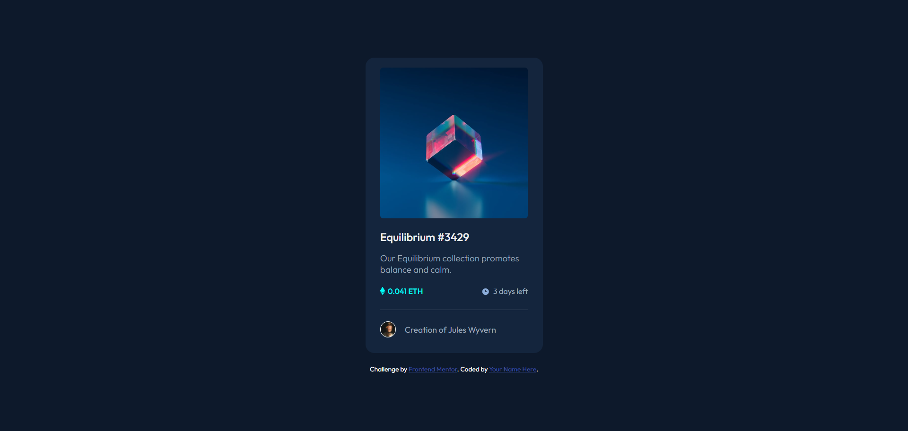
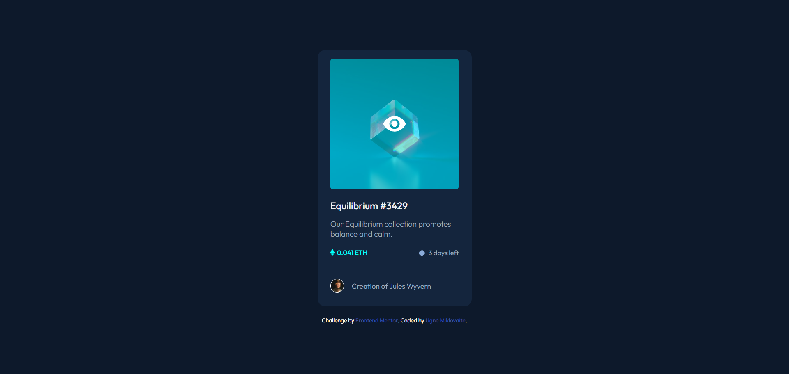
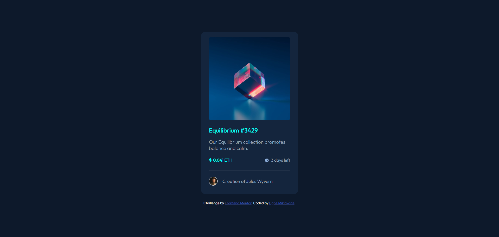
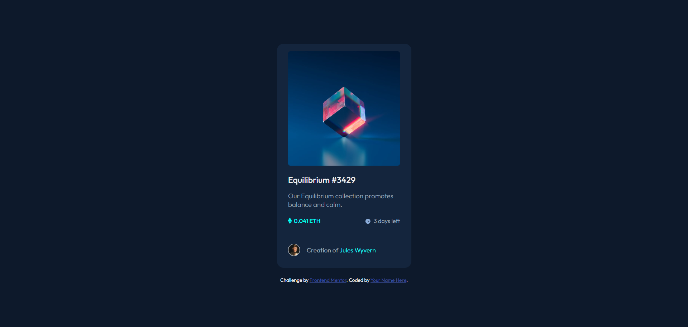

# Frontend Mentor - NFT preview card component

## Welcome! 👋
Thanks for checking out this front-end coding challenge.
This is a responsive NFT preview card component built with HTML and CSS. The design showcases a modern card layout that highlights NFT artwork, complete with hover effects to enhance user interaction.

## Features:
- Responsive design optimized for both desktop and mobile views
- Interactive hover effects for an engaging user experience
- Clean and visually appealing layout focusing on NFT presentation

## Screenshots:

### Desktop View (No Hover):

### Hover Effect 1:

### Hover Effect 2:

### Hover Effect 3:

Feel free to explore the project and provide feedback or suggestions for improvement!
